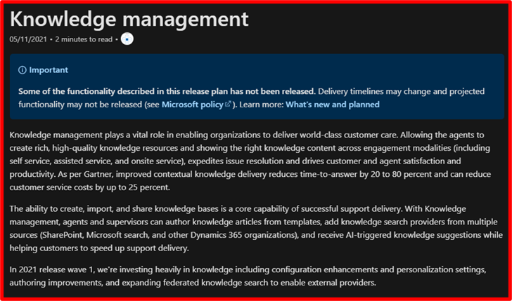

# L2 overview

| Audience | Description |
|-------------|------------|
| TBD | TBD |

The L2 overview gives a top-level description of each subgroup within a main product (for example, **Power Apps** is the product and **Sophisticated apps on a unified platform** is the L2).

## Purpose
This overview should speak to the value of the features as a group, how they benefit the customer, and how they work together.

## Guidelines

