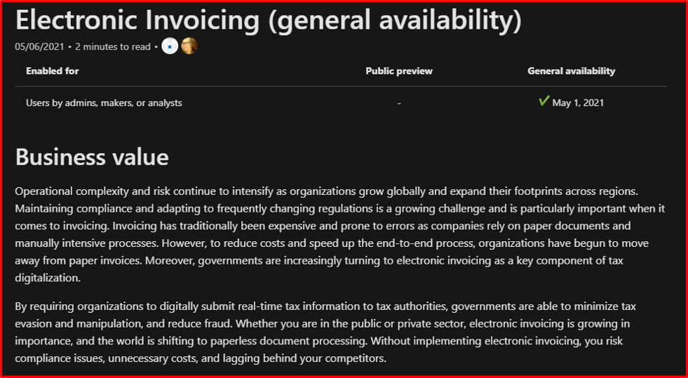

# Business value

| Audience | Description |
|-------------|------------|
| Decision makers | Any person with the authority to make business decisions |

The **Business value** publishes before the feature detail in the release plans. It outlines the benefits and added values that each product offers to its customers.

## Purpose
The **Business value** articulates why a customer should invest in this feature, why they should care, and how it will transform or impact their business. For example: 

## Guidelines
Use the following guidelines when writing the **Business value**:

* Write directly to the user, using words like "you."
* Use informal, casual, but authoritative language. Use contractions, and spell out abbreviations.
* Be concise, but be precise.
* Use the present tense. For example, "bots can use" instead of "bots will be able to use."

