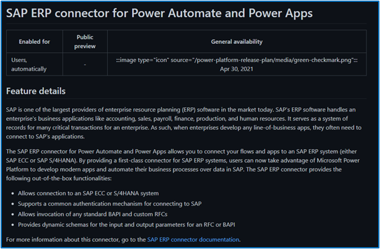

# Feature detail

| Audience | Description |
|-------------|------------|
| TBD | TBD |

The feature detail provides the technical aspects of a feature and is the root of the release plans. It is published on the live site.

## Purpose
The feature detail is the main content of the release plans. It is where the feature is described, and the focus is on important details and technical content. 

## Guidelines
Use the following guidelines when writing the feature detail:

* Be explicit and clear.
* Write directly to the user, using words like "you."
* Use informal, casual, but authoritative language. Use contractions, and spell out abbreviations.
* Be concise, but be precise.
* Use white space; put sentences into individual paragraphs.
* Link to relevant docs using Markdown syntax.
* Use the present tense. For example, "bots can use" instead of "bots will be able to use."

