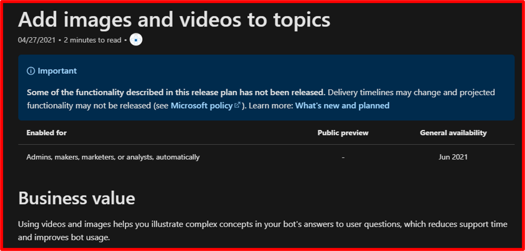

# Feature name

| Audience | Description |
|-------------|------------|
| TBD | TBD |

The **Feature name** appears as the **Title**. It's shown as the H1 on the individual release plan's page and in the table on the **What's new and planned** page. **Feature names** should not exceed 55 characters, otherwise it can impact the Search Engine Optimization (SEO). Long feature names clutter the table of contents and can negatively impact the user experience. Keep in mind that titles are often longer in other languages when translated from the English release plans. For example, the image below shows a long feature name in the TOC in both English and German.

## Purpose
The **Feature name** showcases the core aspects of a feature quickly, clearly, and concisely. 

## Guidelines
Leading with a verb, describe briefly what a user can do (for example, *Add images and videos to topics*). **Do not** include words like "Delete" or "TBD" in feature names as you run the risk of that title being published to the live site. 

> [!NOTE] 
> Editors and writers do not change feature names becaue this impacts the publish and the app. Generally, they will only fix typos or remove invalid characters. Anything updated in the feature name in the app will impact published content as this impacts URLs. The feature name needs to be correct and succinct from the beginning.

