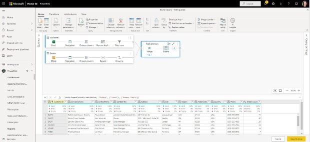

# Images

| Audience | Description |
|-------------|------------|
| All users | Any user viewing release plans regardless of role or responsibility.|

## Purpose
Images provide visual context for features and help the customer understand the benefits and functions of our products by highlighting important processes and capabilities.  When you submit an image in the release planner app, it will get uploaded to the Main branch for that particular repo. Then you can place the image in the correct location within your Markdown text. 

Always preview the feature to ensure the image and text display the way you've intended. You can also preview the image by right-clicking it in the image box, and opening the image in a new tab in your browser.

It's important to consider the following guidelines before you submit your images.

## Quality

Make sure your screenshots, graphics, and images are clear. If it is blurry for you, it will be worse for the readers when it is published. Also, be sure to use images with clear content if it's meant to be readable. Below is an example of a blurry screenshot:  

The screenshot is blurry and it's also unclear what the screenshot is highlighting. Use accessibility-friendly callout boxes, arrows, or highlights to point out the important parts of the screen. The example below shows two screens with boxes added to highlight important areas. The boxes on the left screen cut off text and is not centered properly. The box on the right cleanly and evenly highlight the important area. 

Here are some other tips to make sure screens are captured cleanly and to avoid last-minute fixes:

- Don't take screenshots of your entire desktop if it isn't pertinent to the image. 
  - Avoid showing browser tabs, favorites, taskbars, personalized desktops, user information, etc. 
  - Crop down the screenshot to include just the program's UI in the image.

- Don't capture your cursor if it isn't pertinent to the image. 
  - If it is pertinent, be sure the cursor isn't blocking any text or graphics.
  >![NOTE]
  >Most screen capture programs have settings that will not capture cursors when screenshots are taken.

- Create a useful image filename that is free from typos. When users save images from release plans, it saves with the filename you've created. 

## Legal and technical 

The release planner app only accepts images with .jpeg or .png extensions.  

Don't use copyrighted images.  

Ensure all the data, names, addresses, profile images, email addresses, phone numbers, and other content is approved sample data and follows CELA guidelines. Images that contain PII will be removed by editors. You will need to confirm that the content in the images is safe to publish and be seen by the public by toggling the check before submitting your image.

##  Accessibility 

Alt-text is important not only because it provides the captions for our screens, it also makes our content accessible to all of our readers. The alt-text should be a detailed description of the image or graphic, include keywords, and be no longer than 125 characters (screen readers tend to cut off at this length). 

Alt-text also provides some SEO value to your features.

>![NOTE]
>The alt-text provided in the release plans is used to generate the figure captions in the PDF.

