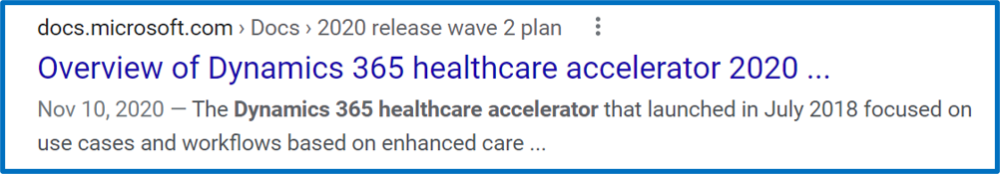
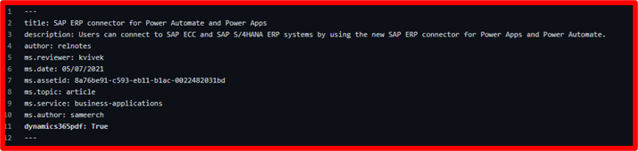

# Metadata

| Audience | Description |
|-------------|------------|
| TBD | TBD |

The metadata is "hidden" content that helps users find topics through search engines. 

## Purpose
Search engines use the content in the metadata field to generate relevant results to users. Below is an example of what users see in their searches:

## Guidelines
Use the following guidelines when writing metadata:

* Describe the feature in a brief but impactful way.
* Use full sentences, not just a list of keywords.
* Include important words that aren't in the description or title. What would your audience type into a search engine to look for this feature?
* Imagine what this will look like in a search result. Notice how the content is cut off in the image above.
* **Do not** just repeat the feature name.

