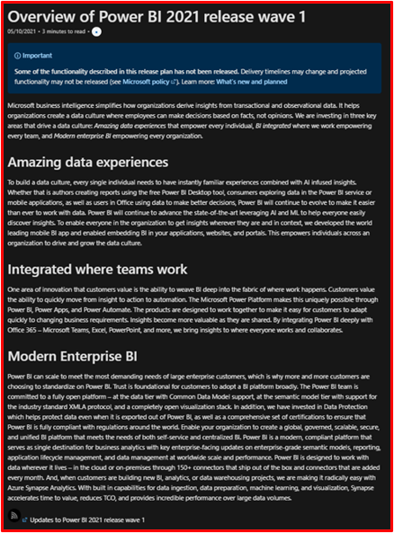

# Product overview

| Audience | Description |
|-------------|------------|
| TBD | TBD |

The product overview gives a top-level description of each product (for example, Power Apps).

## Purpose
At this level, the overview should showcase the best parts of a product, what's new in the product, and a highlight of supporting resources. For example:

## Guidelines

**First paragraph**: This should provide brief information about the product, such as:

* *Microsoft Power Apps is the industry-leading, low-code application development platform that underpins Dynamics 365 extensibility, Microsoft 365 customization, and standalone, custom line-of-business applications for customers around the world. Power Apps dramatically lowers the cost, complexity, and time of software development through a range of powerful low-code development tools, a deep data platform in Microsoft Dataverse, and hundreds of connectors to common business data sources.*

**Second paragraph**: This should talk about the new capabilities available in the wave for the product at a high level, such as: 
 
* *There are many areas that are being invested in for Power Automate as a part of 2021 release wave 1. First, Microsoft Teams, with more than 100 million daily active users, is central to Microsoft's remote work strategy, and Power Automate is key to the Microsoft Teams extensibility strategy by providing automation for your collaboration scenarios. We will build more and easier entry points across the Microsoft Teams experience, such as in meetings/calendars and other types of conversations. It will also be possible for administrators to push solutions that contain flows across the teams in their organization.*

**Third paragraph**: This should include related links to our Docs and Learn for the product. This basically lets our “prospective customers” be aware of our rich library of learning resources, such as:

* *For official product documentation and training for *Product name*, see: 
    * *Product name* docs 
    * *Product name* training on Microsoft Learn

> ![NOTE]
> We won't have links to supporting content when we first publish. This information becomes available as the features are developed and supporting content is created. Also, they are not required fields. 

