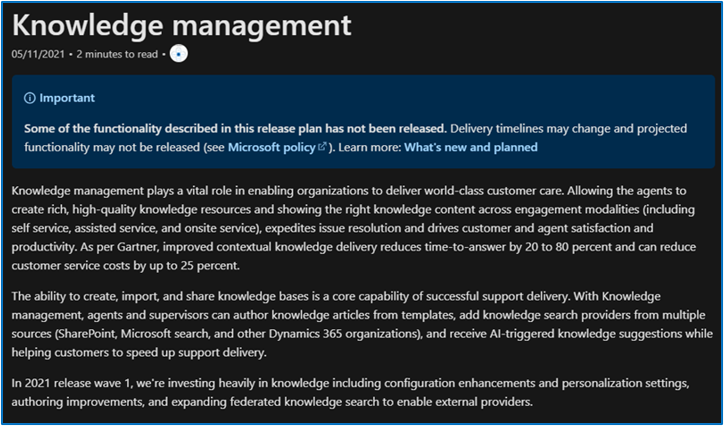

# L2 overview

| Audience | Description |
|-------------|------------|
| Business decision makers | People within an organization that are looking to understand what the investment areas and overview mean for business, how they would be impacted by it, and why they should care. |

## Purpose

The **L2 overview** gives a top-level description of each subgroup within a main product (for example, **Power Apps** is the product and **Sophisticated apps on a unified platform** is the L2). This overview should speak to the value of the features as a group, how they benefit customers, and how they work together.

## Guidelines

Below is an example of a strong L2 overview. Click the image to go to the release plan.  

