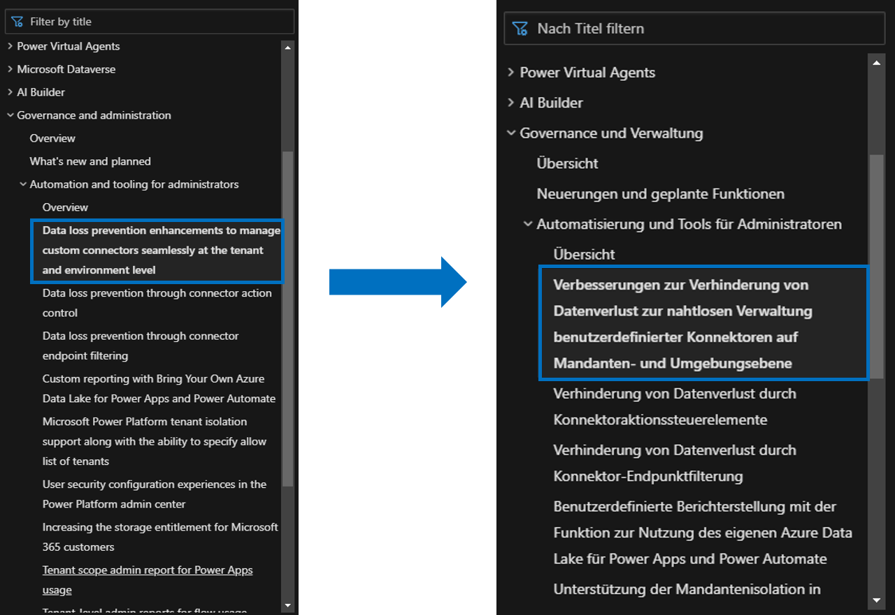

# Feature name

| Audience | Description |
|-------------|------------|
| Business decision makers | People within an organization that are looking to understand what the investment areas and overview mean for business, how they would be impacted by it, and why they should care. |
| Technical roles | People within an organization that are looking to understand what the feature is and how it will work. |

## Purpose
The **Feature name** appears as the **Title**, and it showcases the core aspects of a feature quickly, clearly, and concisely. It's shown as the H1 on the individual release plan's page and in the table on the **What's new and planned** page. 

## Guidelines

- Lead with a verb.
- Describe briefly what a user can do.
- Do not include words like "Delete" or "TBD" in feature names as you run the risk of that title being published to live.
- Do not include the status of the feature. GA, PP, and EA statuses are tracked in the table in the feature. Having the status in the name requires renaming the feature if the status changes, which introduces risks like broken links or conflicting information.
- Do not exceed 55 characters because it can impact Search Engine Optimization (SEO). Long feature names clutter the table of contents and can negatively impact the user experience. Titles are often longer in other languages when translated from English. For example, the image below shows a long feature name in the TOC in both English and German.  

> [!NOTE] 
> Editors and writers do not change feature names becaue this impacts the publish and the app. Generally, they will only fix typos or remove invalid characters. Anything updated in the feature name in the app will impact published content as this impacts URLs. The feature name needs to be correct and succinct from the beginning.

Below is an example of a strong Feature name. Click the image to go to the release plan.  

