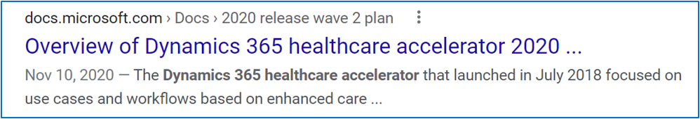

# Metadata

| Audience | Description |
|-------------|------------|
| Business decision makers | People within an organization that are looking to understand what the investment areas and overview mean for business, how they would be impacted by it, and why they should care. |
| Technical roles | People within an organization that are looking to understand what the feature is and how it will work. |

## Purpose
The metadata is "hidden" content that helps users find topics through search engines. Search engines use the content in the metadata field to generate relevant results to users. 

## Guidelines
Use the following guidelines when writing metadata:

* Describe the feature in a brief but impactful way.
* Minimum 100, max 160 characters including spaces.
* Use full sentences, not just a list of keywords.
* Include important words that aren't in the description or title. What would your audience type into a search engine to look for this feature?
* **Do not** just repeat the feature name.
* Imagine what this will look like in a search result. Notice how the content is cut off in the image below.

Below is an example of strong metadata. In GitHub, the metadata populates in the *description* line. 

