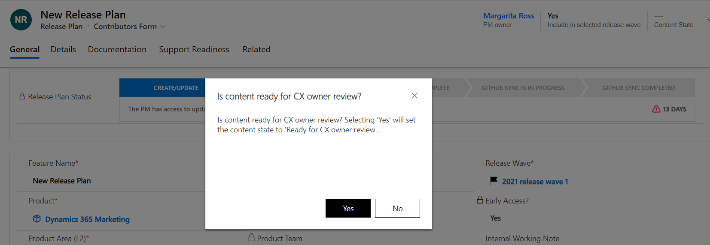
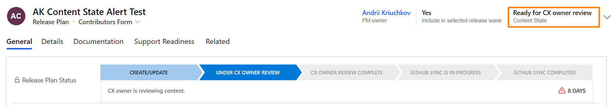
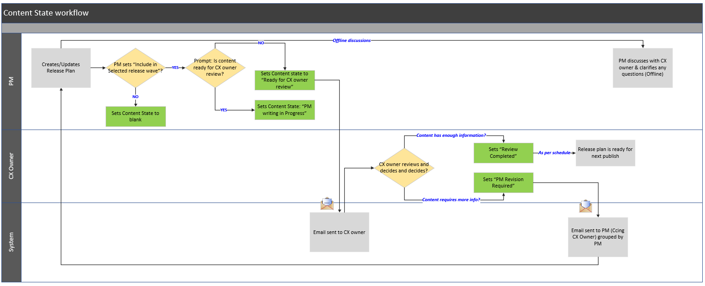

# Feature: Content state status  

**Persona:** Program Managers, Release Managers, Release POCs, and Content Publishing Team  

**Why this feature:**

Release Plans are currently not reflecting the different stages which makes it challenging for the Engineering PMs to understand the current status of the plan. As an example, today’s workflow assumes that when a PM creates a release plan, it is ready for the CX owner’s review. When the CX owner reviews the content, they realize that the content is still in the early draft status and have little to no information at times. Similarly, when the PM is still authoring the content, CX owners are reviewing the content regardless of whether the content is completed or not without having any interim state that allows the PMs to put the content in the draft mode.  

The ‘Content state’ status improvements are implemented to optimize and detail this process.    

**How does it work:**

By introducing the different content states, we have made the following changes in the Contributors and in the CX owner forms 

  - **Include in Release Plan** toggle is renamed to **Include in Selected Release Wave**. To edit the value, you will have to select the drop down in the header as shown below.  

  - Content State is enabled only when “Include in selected release wave” is set to “Yes” and try to save the release plan. Content state field is editable only for the CX owners. 

**Scenario 1: Creating & updating the release Plans**

Yes, the system will prompt to confirm if the content is ready for the CX owner review. If the “Include in selected release wave” is set to “No”, then the content state is blank.  

  - When the PM sets “Yes” to the prompt, the content state will be set as “Ready for CX owner review” and if not, it will be set as “PM writing in Progress” state.  

  - The CX owner will be notified when the Release plans are to “Ready for CX owner review” 

**Scenario 2: CX owner reviews the release plans**

When the CX owner reviews the release plan, they will be presented with two options under the Content state. 

  - **PM revision required** – This state is selected when the CX owner determines that more information is required by the PMs. An automated email notification will be sent to the PMs requesting for more information.  

  - **Review completed** – This state is selected when the CX owner review is completed. The content gets picked up for publishing according to the content schedule.  

**Note: When the content state is in “PM writing in progress” or “PM revision required”, the CX owner will not be able to update the content state as it is under PM’s preview.**  

The process flow is graphically presented in this diagram:  

Checkout the demo to understand how this feature works:

> [!VIDEO https://msit.microsoftstream.com/embed/video/e8e80840-98dc-869c-daf8-f1ebcfd2edae?autoplay=false&showinfo=true]

