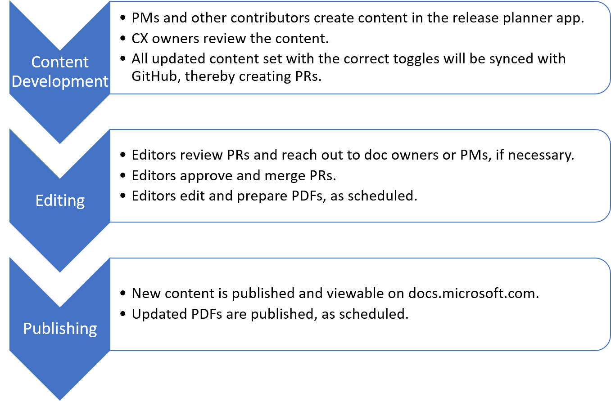

# Release plans overview

This guide provides information on how CX owners, contributors, PMs, editors, and other team members can add to our official release plans content on [docs.microsoft.com](https://docs.microsoft.com/business-applications-release-notes/). This guide provides specific information about release plans from content development to publishing. 

> [!NOTE]
> Since this guide is specific to **Release plans**, there will be differences from the [Contributors' Guide for Docs](contributors-guide.md). In instances of conflict, this guide wins.

## Current release plans

These release plans and PDFs are current and updated regularly.

- **[Dynamics 365: 2021 release wave 1 plan](https://docs.microsoft.com/dynamics365-release-plan/2021wave1/)**
- **[Microsoft Power Platform: 2021 release wave 1 plan](https://docs.microsoft.com/power-platform-release-plan/2021wave1/)**

## Archived release plans

These release plans and PDFs are archived and will no longer be updated.

- **[Dynamics 365: 2020 release wave 2 plan](https://docs.microsoft.com/dynamics365-release-plan/2020wave2/)**
- **[Microsoft Power Platform: 2020 release wave 2 plan](https://docs.microsoft.com/power-platform-release-plan/2020wave2/)**
- **[Dynamics 365: 2020 release wave 1 plan](https://docs.microsoft.com/dynamics365-release-plan/2020wave1/index)**
- **[Microsoft Power Platform: 2020 release wave 1 plan](https://docs.microsoft.com/en-us/power-platform-release-plan/2020wave1/)**
- **[Dynamics 365: 2019 release wave 2 plan](https://docs.microsoft.com/dynamics365-release-plan/2019wave2/)**
- **[Power Platform: 2019 release wave 2 plan](https://docs.microsoft.com/power-platform-release-plan/2019wave2/)**
- **[April '19 release notes](https://docs.microsoft.com/business-applications-release-notes/April19/index)**
- **[October '18 release notes](https://docs.microsoft.com/business-applications-release-notes/October18/index)**
- **[April '18 release notes](https://docs.microsoft.com/en-us/business-applications-release-notes/April18/index)**

## Release plan fields

| Field | Description | Audience |
| ----- | ----- | -----|
| [Product overview](product-overview.md) | A top-level description of each product that showcases the best parts of a product and new features | Business decision makers, Technical roles |
| [L2 overview](L2-overview.md) | A top-level description of each subgroup within a main product | Business decision makers |
| [Feature name](feature-name.md) | Showcases the core aspects of a feature quickly, clearly, and concisely | Business decision makers, Technical roles |
| [Metadata](metadata.md) | "Hidden" content that helps users find topics through search engines | Business decision makers, Technical roles |
| [Business value](business-value.md) | Outlines the benefits and added values that each product offers to its customers | Business decision makers |
| [Feature detail](feature-detail.md) | A description of the technical aspects of a feature, focusing on the most important details | Business decision makers, Technical roles | 

## Release plans workflow

There are many working parts to publishing release plans to docs.microsoft.com. It is important to know how each step and role impact the overall process. The graphic below shows each step of the process:  

The content is created in the release planner app, and a flow pushes the content to GitHub as pull requests (PRs). The flow pushes edited content back into the release app. This is called the "reverse sync" as shown in the graphic below:  

<!--## Release Planner Tool-->

<!--Should they be called PMs, writers, or doc owners? -->

<!--To create or update release plans for wave 2 or later, **PMs** should work in the [Release Planner Tool](https://aka.ms/bagreleasenotes). 

For guidance on using the tool, see these resources (available under Resources in the left navigation pane of the tool):
- [BAG Release Planner App Guide](https://microsoft.sharepoint.com/:w:/t/ProjectBahnhof/EYBGZgE9Js5CioBE2LAIjSwBCgn_hvM9QtZ7gPimS85vkQ?rtime=RWW9laMl10g) 

- [Demo video](https://msit.microsoftstream.com/video/c78b4dec-e4c3-4cd9-b827-c6535c11757a?list=studio)

## GitHub

To create a GitHub account and join our org, read the [Contributors Guide](contributors-guide.md), in particular [Get started](get-started.md) and [Work directly in our repos](work-repos.md).

For **PMs** still working on April '19 content: A best practice is to create your own branch off of the working branch (master), and then make all your changes to it for the feature or features you are working on. For example, if you update the description and target release date for a feature, you would create a branch, make your changes, and then create a pull request (PR) to merge the updates into the master branch. 

**Editors** will review pull requests in GitHub. If they have questions about the content, they'll contact the Doc owner in email. Otherwise, they'll approve and merge the pull requests into the master branch, where it will go live with the next publish. 

**Warning:** Once a PR is merged into master, it can go live at any time. Never submit a PR until you are sure the information about the feature is ready to be public knowledge. 

<!--this needs updating:

 -->
 

