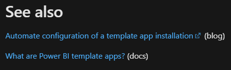

# See also

| Audience | Description |
|-------------|------------|
| TBD | TBD |

## Purpose
The **See also** section is used to direct users to helpful and relevant supporting content. The links under **See also** provide an additional layer of support to our users thus improving the user experience. Since the release plans are highly-focused and technical, this section gives users the option to learn more about the product, features, capabilities, and more. 

>![NOTE]
>Links in **See also** have identifiers behind them to let users know what type of resource they're being linked to as shown in the screen below. There are videos, blogs, and docs (for product documentation).

## Guidelines

Use the following guidelines when including **See also** links:

* To reduce confusion for the users, be sure the link has the same title as the content it is being linked to. 
* If the link is to an achor on a page, use the name of the section it is being linked to so users will be able to find it if the link redirects to the wrong location.
* Avoid using special characters when possible. 
* Do not use the name of the release plans topic for the link title. 
* Be sure to remove the /en-us/ reference in the URL because it forces the link to the English translation, which is not a good user experience for our non-English speaking readers. 
  >![NOTE]
  >Editors have to manually remove language references in URLs.

